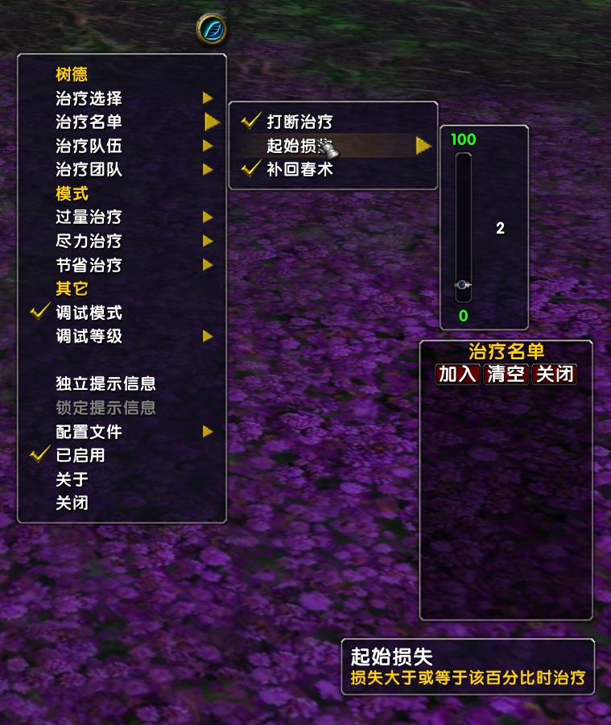
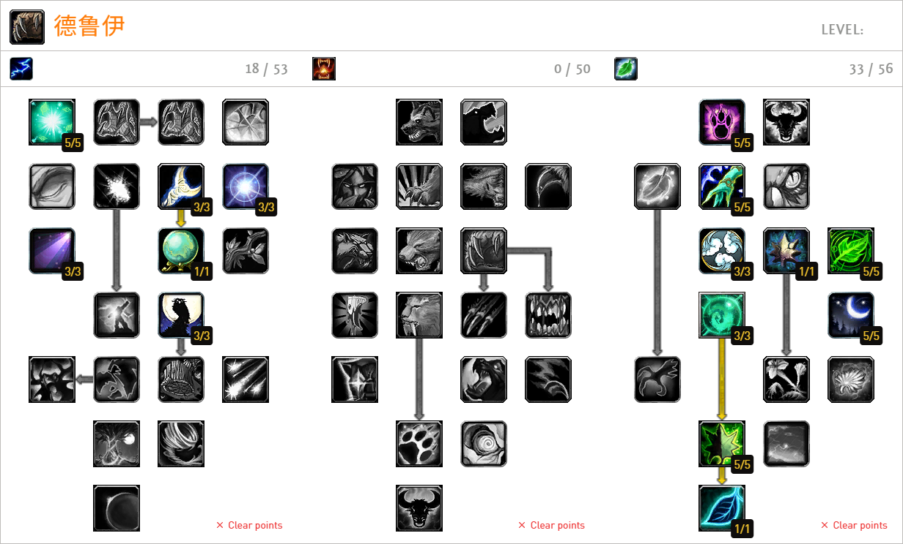

# 树德辅助插件

> __自娱自乐，不做任何保证！__  
> 如遇到BUG可反馈至 xhwsd@qq.com 邮箱


## 功能



- 可视化设置
- 无脑一键
- 自定义治疗名单
- 名单补回春
- 打断过量治疗
- 等...


## 使用
- 安装`!Libs`插件
- [可选][[文档](https://github.com/xhwsd/SuperMacro/)][[下载](https://github.com/xhwsd/SuperMacro/archive/master.zip)]安装`SuperMacro`插件，安装后将获得更多宏位
- [[文档](https://github.com/xhwsd/DruidTree/)][[下载](https://github.com/xhwsd/DruidTree/archive/main.zip)]安装`DruidTree`插件
- 基于插件提供的函数，创建普通或超级宏
- 将宏图标拖至动作条，然后使用宏

> 确保插件最新版本、已适配乌龟服、目录名正确（如删除末尾`-main`、`-master`等）


## 入门
- 小地图菜单中有`树德`插件选项，可以根据提示进行微调
- 将多个坦克（尽量少）加入名单，然后无脑使用`治疗全部`宏


## 可用宏

> 使用该系列宏需确保有一个治疗法术（回春术、愈合、治疗之触）在动作条任意位置


### 治疗选择

> 尝试治疗选择目标

```
/script -- CastSpellByName("愈合")
/script DruidTree:HealSelect()
```

逻辑描述：
- 已按ALT使用时，过量治疗选择目标
- 未按ALT使用时，打断过量治疗，尽力治疗选择目标


### 治疗名单

> 尝试治疗名单中损失最多的目标

```
/script -- CastSpellByName("愈合")
/script DruidTree:HealRoster()
```

逻辑描述：
- 打断过量治疗
- 补名单回春术
- 尽力治疗名单中损失最多的目标


### 治疗队伍

> 尝试尽力治疗队伍中损失最多的目标

```
/script -- CastSpellByName("愈合")
/script DruidTree:HealParty()
```

逻辑描述：
- 打断过量治疗
- 尽力治疗队伍中损失最多的目标


### 治疗团队

> 尝试节省治疗团队中损失最多的目标

```
/script -- CastSpellByName("愈合")
/script DruidTree:HealRaid()
```

逻辑描述：
- 打断过量治疗
- 节省治疗团队中损失最多的目标


### 治疗全部

> 尝试治疗名单、团队、队伍、选择中损失最多的目标  
> 保持名单满级回春和尽力治疗，然后节省治疗其它成员

```
/script -- CastSpellByName("愈合")
/script DruidTree:Heal()
```

逻辑描述：
- 打断过量治疗
- 补充名单回春术
- 尽力治疗名单中损失最多的目标
- 如果名单无损失目标，将尝试治疗团队（在团）、队伍（在队）、选择

> 无脑主用该宏，其它宏看情况抉择！


## 参考

### 天赋
[](https://talents.turtle-wow.org/druid?points=oAAbYIAYAAAAAAAAAAAAAAAAAAAAFAFADNDFAAFABAA=)
